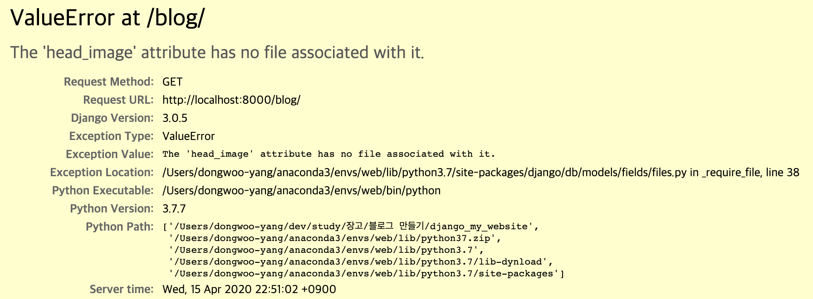

# 사진 업로드를 위한 ImageField와 업로드된 파일 관리 방법

> blog/models.py

```python
from django.db import models
from django.contrib.auth.models import User


# Create your models here.
class Post(models.Model):
    # 제목
    title = models.CharField(max_length=30)
    # 내용
    content = models.TextField()
    # 이미지 파일 저장을 위한 객체
    # upload된 이미지 파일은 blog에 저장이 된다. blank = True는 공란이여도 된다는 의미이다.
    head_image = models.ImageField(upload_to='blog/', blank=True)

    # 작성 일자
    created = models.DateTimeField()
    # 저자
    author = models.ForeignKey(User, on_delete=models.CASCADE)

    # 해당 객체를 문자열로 바꿧을 때 어떤 식으로 보여줄 것인지를 결정한다.
    def __str__(self):
        # 작성된 페이지의 제목과 저자를 보여준다.
        return '{} :: {}'.format(self.title, self.author)

```

`head_image = models.ImageField(upload_to='blog/', blank=True)`를 추가했으므로 이제 이미지 파일을 올릴 수 있게 되었다.  
이렇게 할 경우 일반적으로 blog폴더에 계속 이미지 파일이 생기게 됨으로 settings.py에 가서 이미지가 저장될 수 있는 폴더를 설정해주어야 한다.

## 미디어가 저장될 기본 폴더 설정하기

> mysite/settings.py

```python
MEDIA_ROOT = os.path.join(BASE_DIR, '_media')
```

이미지 파일이 `_media`폴더에 저장되게 된다.

## 날짜별로 사진 파일 저장하기

> blog/models.py

```python
# 이미지 파일 저장을 위한 객체
# upload된 이미지 파일은 blog에 저장이 된다. blank = True는 공란이여도 된다는 의미이다.
head_image = models.ImageField(upload_to='blog/%Y/%m/%d/', blank=True)
```

`upload_to='blog/%Y/%m/%d/'`로 저장하게 되면 날짜별로 사진 파일이 저장되게 된다.

## 사진 반영하기

> 변경전

> blog/templates/blog/post_list.html

```html

```

```html

```

### 결과



블로그 포스트에 사진이 없는 것들이 있기 때문에 이 오류가 뜨게 된다.

> mysite/settings.py

```python
MEDIA_URL = '/_media/'
```

> mysite/urls.py

```python
from django.contrib import admin
from django.urls import path, include

# static을 추가한다.
from django.conf.urls.static import static
# settings를 추가한다.
from django.conf import settings

urlpatterns = [
    path('admin/', admin.site.urls),
    path('blog/', include('blog.urls')),
]

# static 파일의 media파일을 MEDIA_URL과 연결한다.
urlpatterns += static(settings.MEDIA_URL, document_root=settings.MEDIA_ROOT)
```
